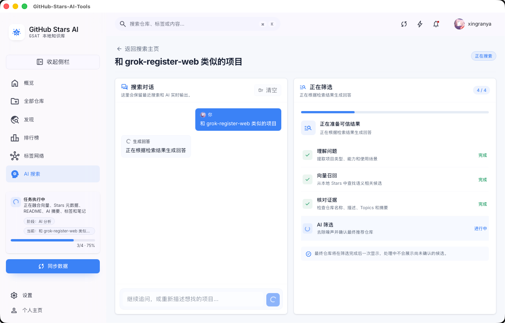
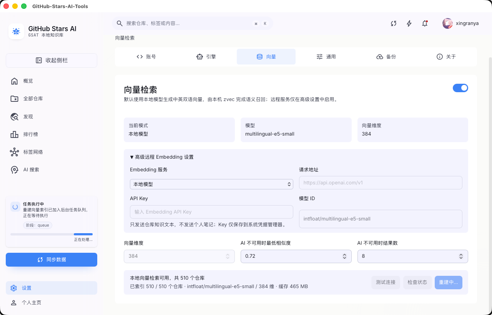

<div align="center">
  
  <h1>GitHub-Stars-AI-Tools</h1>
  <p><strong>把 GitHub Stars 变成可搜索、可总结、可继续追问的本地 AI 知识库。</strong></p>
  <p>
    <a href="LICENSE"></a>
    <a href="https://tauri.app/"></a>
    <a href="https://react.dev/"></a>
    <a href="https://www.rust-lang.org/"></a>
  </p>
</div>

| 项目介绍 | 项目介绍 |
| --- | --- |
|  |  |
|  |  |
|  |  |
|  |  |
|  |  |

## 适合谁

- GitHub Stars 很多，经常想不起某个项目到底解决什么问题的人。
- 希望把 README、标签、笔记和 AI 摘要沉淀到本机的人。
- 想用自然语言搜索收藏项目，并继续追问“怎么用、怎么部署、适合什么场景”的人。
- 想整理技术栈偏好、标签网络和相似项目的人。

## 核心能力

| 能力 | 说明 |
| --- | --- |
| Stars 本地知识库 | 同步 GitHub Stars 到本机 SQLite，保留仓库元数据、Topics、语言、README、标签、笔记和阅读状态 |
| README 解析 | 缓存 README，并生成中文摘要、关键词、建议标签和项目知识卡 |
| 本地向量检索 | 首次启用时下载中英双语 Embedding 模型，通过 SQLite 与 zvec 在本机完成语义召回，下载后可离线检索 |
| 聊天式 AI 搜索 | 像对话一样描述需求，先从本地向量索引召回候选，再由 AI 筛选并同步生成回答和最终仓库列表 |
| 搜索结果解释 | 每个结果展示匹配原因、命中字段、README 片段和可继续追问的操作 |
| AI 标签网络 | 根据收藏仓库生成标签建议和项目关联，帮助整理技术栈 |
| 相似项目发现 | 基于已收藏项目生成 GitHub Search 策略，发现替代项目或同类项目 |
| 个人知识画像 | 展示收藏趋势、语言偏好、最近收藏、AI 摘要字数和用量概览 |
| 注解同步 | 通过私密 Gist 导出和导入标签、笔记、阅读状态等个人注解 |

## 最近更新

- 向量检索新增独立设置页：首次启用会确认并下载本地中英双语模型，展示下载、校验、加载和建库进度。
- AI 搜索先召回最多 30 个向量候选，再由 AI 筛选 0 到 10 个最终结果；回答和右侧仓库列表保持一致。
- 搜索过程中展示理解问题、向量召回、核对证据和 AI 筛选阶段，未经确认的候选不会提前显示。
- README AI 解析改为增量处理，只更新缺少摘要或 README 内容已经变化的仓库。
- AI 设置新增常用预设：OpenAI、Anthropic、OpenRouter、DeepSeek、Moonshot/Kimi、通义 Qwen、智谱 GLM、硅基流动、Ollama、LM Studio 和自定义 OpenAI 兼容接口。
- 主题系统支持品牌色、字号和图标联动，应用图标、主要按钮、导航状态和图表颜色会跟随主题色变化。
- 顶部快捷面板支持常用任务入口，通知面板和快捷面板支持点击空白处关闭。
- 应用内更新支持启动静默检查、设置页手动检查、下载进度和安装后重启。

## 快速开始

系统要求：macOS 10.15+、Windows 10+ 或 Linux。安装包用户无需安装 Node.js、pnpm 或 Rust。

1. 安装并启动 GitHub-Stars-AI-Tools。
2. 在欢迎页或设置页连接 GitHub Personal Access Token。
3. 点击“同步 Stars”，把收藏仓库写入本机数据库。
4. 点击“抓取 README”，缓存仓库详情。
5. 可选：在设置页配置 AI 服务，生成摘要、标签网络、AI 搜索解释和相似项目推荐。

### macOS 首次打开提示

当前 macOS 安装包暂未使用 Apple Developer ID 签名，首次打开时可能提示“移动到废纸篓”或“无法打开”。这是系统 Gatekeeper 对未签名应用的拦截，不代表应用损坏。

建议优先使用 Finder 放行：将应用安装到“应用程序”后，在 Finder 中按住 Control 点击 `GitHub-Stars-AI-Tools.app`，选择“打开”，再在系统确认弹窗中继续打开。

如果仍然无法打开，可以在终端移除隔离属性后再启动：

```bash
xattr -dr com.apple.quarantine "/Applications/GitHub-Stars-AI-Tools.app"
```

如果提示权限不足，再使用 `sudo` 重新执行同一命令。建议只安装来自本项目 GitHub Release 的安装包。

## AI 服务

GSAT 支持 OpenAI、Anthropic 和 OpenAI 兼容接口。你可以直接选择常用提供商预设，也可以手动填写自定义 Base URL 和模型 ID。

本机服务如 Ollama、LM Studio 可不填写 API Key；云端服务的 API Key 会保存到系统凭据管理器。

## 数据与隐私

- GitHub Token 和 AI API Key 保存到系统凭据管理器，不写入 localStorage。
- Stars、README、标签、笔记和 AI 文档保存在本机数据库。
- AI 功能只有在你主动配置并使用时才会请求对应服务。
- Gist 同步使用私密 Gist，仅包含标签、笔记、阅读状态等用户注解数据。

## 应用更新

应用启动时会静默检查新版本；发现更新后会在应用内提示。你也可以在“设置 → 通用设置 → 应用更新”手动检查、安装并重启。

更新日志见 [docs/releases](docs/releases)。

## 许可证

本项目采用 [PolyForm Noncommercial License 1.0.0](LICENSE)。源码可用于个人学习、研究、非营利组织和非商业场景；商业使用、商业再分发或商业产品集成需要先获得书面授权。

## 致谢

感谢 [Tauri](https://tauri.app/)、[React](https://react.dev/)、[Rust](https://www.rust-lang.org/)、[SQLite](https://www.sqlite.org/)、[pnpm](https://pnpm.io/) 以及相关开源生态。
